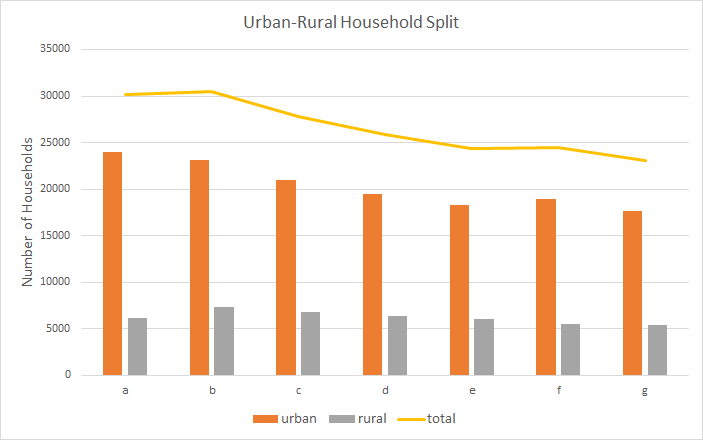
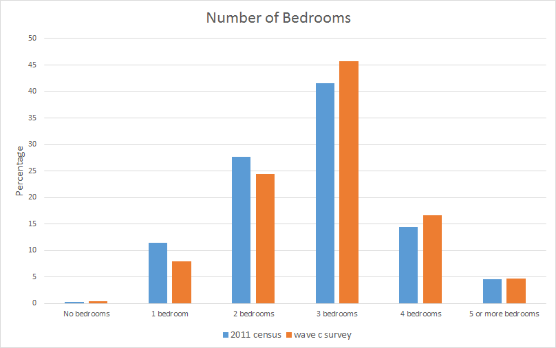
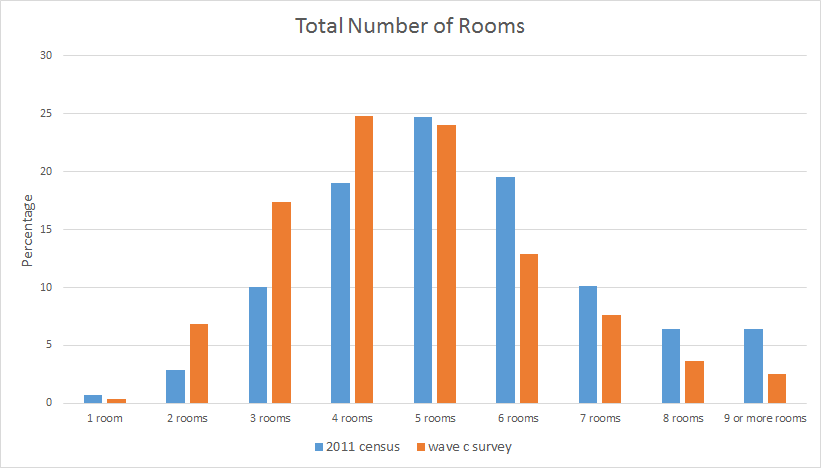
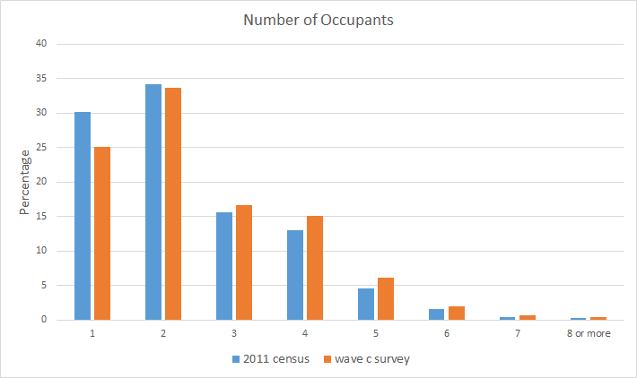
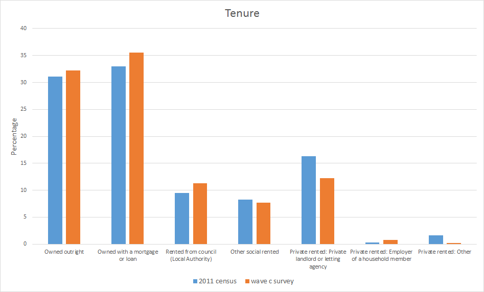
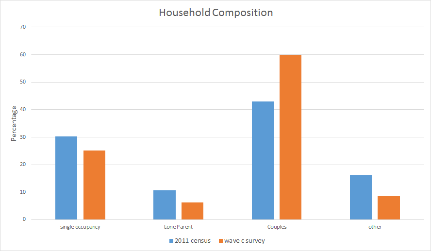

# UKsurvey

Things to do:
- keep Readme updated
- could use ukcensusapi module to obtain census data
- give examples for every script?
- create python module 

## Table of contents
- **1.** [Introduction](#introduction)    
   + **1.1.** [SPENSER](#spenser)      
- **2.** [Data](#data)
   + **2.1.** [Understanding Society](#understanding-society)       
   + **2.2.** [Census](#census)       
   + **2.3.** [Comparing Survey and Census Data](#comparing-survey-and-census-data)     
- **3.** [Household Microsynthesis](#household-microsynthesis)
- **4.** [Method](#method)
    + **4.1.** [Mapping Survey to Census](#mapping-survey-to-census)   

## Introduction
The objective of this project is to visualise the transitions that occur during the microsynthesis of population, as well as the events that trigger these transitions. This work is part of a bigger project aiming to create a framework for customisable population estimates (see [SPENSER](#spenser)). Here, understanding Society data is used to complement ONS census data. In the future, other datasets will be added. (consumer data, information on migration etc.)

For now, the repository is a list of scripts I am using for analysis.

### SPENSER 
Synthetic Population Estimation and Scenario Projection Model (SPENSER) is a synthetic population estimation and projection model which uses dynamic microsimulation. It provides the framework for estimates of population which are dynamic and high resolution (at household level); and a comprehensive set of tools for user customisable scenario projections. This project is in development by the University of Leeds.

## Data
### Understanding Society

Understanding Society is a longitudinal study of the behaviour of ~40,000 households across the UK.

Data can be downloaded from [UK Data Service](https://beta.ukdataservice.ac.uk/datacatalogue/series/series?id=2000053). It is available in several formats (SPSS, STATA, TAB). Downloading the TAB survey yields two folders: mrdoc and tab, the former contains documentation (including data dictionaries) and the latter the survey response data.

Data is divided into years or waves, each saved in its own subfolder. The survey changes over time so each folder will contain a different amount of files. However, there is a set of common files:

- **_w_callrec.tab_**
- **_w_child.tab_**
- **_w_egoalt.tab_**
- **_w_hhresp.tab_**
- **_w_hhsamp.tab_**
- **_w_income.tab_**
- **_w_indall.tab_**
- **_w_indresp.tab_**
- **_w_youth.tab_**

Where *w_* is a prefix denoting the wave. The first wave is denoted *a*, second wave is *b* etc.    
Individuals have a unique ID (*pidp*), which is persistent throughout the study. Households also have their own ID (*w_hidp*), nonetheless this is wave specific, thus cannot be used to link information across waves. This means an individual's evolution can be tracked over time, but household transitions have an added layer of complexity. 

The largest files are the individual survey responses (**_w_indresp.tab_**). The other group of files of interest are the household response files (**_w_hhresp.tab_**).

|File name |Number of variables* |Description                                          |
|----------|---------------------|-----------------------------------------------------|
|w_hhresp  |200-550              | Substantive data from responding households          
|w_indresp |1300-2900            | Substantive data from responding adults (16+)        
|w_youth   |120-170              | Substantive data from youth questionnaire (10-15)    
|w_hhsamp  |50-200               | Data from Address Record File for issued households  
|w_indall  |100-200              | Household grid data for all persons in household, including children and non respondents
|w_child   |130-350              | Childcare, consents and school information of all children in the household 
|w_egoalt  |10-25                | Kin and other relationships between pairs of individuals in the household

<nowiki>*<nowiki>Questions asked in the survey changed every year, so the number of variables is inconsistent.

There is another subfolder with cross wave data. It consists of three files:

|File name |Description                                           |
|----------|------------------------------------------------------|
|xwavedat  | Substantive data from responding households          |
|xivdata   | Substantive data from responding adults (16+)        |
|xwaveid   | Individual and household identifiers across all waves|

Cross wave files contain data from every wave, however, the files are small compared to __indresp__ and don't seem to have anything useful for microsynthesis - other than the identifiers in __xwaveid__.

There is considerable attrition in this survey, this is partially compensated by introducing new households in each wave, however, there is a net 23% decrease in housholds over the first 7 years.

    
**Figure 1.** Number of households in urban or rural areas. The number of houses decreases as the study goes on. The average split is 76% urban and 24% rural - standard deviation ~ 1.5%. 

More information on the survey can be found here: https://www.understandingsociety.ac.uk.

### Census

The Office for National Statistics produces a national population census every 10 years. ONS gives free access to the latest one - currently 2011.     
The census is the most accurate representation of population data available, thus is often used for population microsynthesis. However, it only occurs once every 10 years and lacks behavioural and consumer data. This is why it is important to complement census with other datasets.   

Data can be obtained directly from [Nomisweb](https://www.nomisweb.co.uk).    
See [UKCensusAPI](https://github.com/virgesmith/UKCensusAPI) for a `python` and `R` wrapper.

### Comparing Survey and Census Data

Overall, the distributions obtained by Understanding Society match census data. There are some differences, mainly because the survey is much smaller than the census, but also because both are just samples of the true population. 

All tested variables were highly correlated. The weakest associacion was with total number of rooms. This is most likely due to the mismatch in definitions for this variable on each dataset. However, there was still significant correlation, r=0.738. 

The following graphs compare the distribution of census (blue) and survey (orange) data for 2011. 

     
**Figure 2.** Percentage distribution of number of bedrooms in each household.

     
**Figure 3.** Percentage distribution of total number of rooms in each household.

     
**Figure 4.** Percentage distribution of number of occupants in each household.         

Note that the number of categories has been expaned here compared to what is used in population microsynthesis. This is to give a better view of the distributions and because the data is available to this degree of accuracy. Comparing household composition and tenure is also possible but the limited amount of categories makes the correlations less reliable.

**Figure 5.** Percentage distribution of tenure type in each household.

**Figure 6.** Percentage distribution of household composition.

## Household Microsynthesis

Possible changes to a household:
- Ageing
- Marriage / civil partnership
- Birth of a child / adoption
- Divorce / separation
- Death of a member
- Child moving out due to higher education / employment
- Member returning from higher study
- Changes in employment / retirement status
- Household location movement (internal migration)
- Leaving system (external migration)
- Leaving study (attrition)
- New household (external migration)
- New household (study recruitment)

Population microsynthesis requires an initial seed. This can be generated by crosstabulating census (or survey) data, depending on the variables being explored.

Combining survey and census data is challenging due to the many ways variables can be defined, especially those relating to behaviours or to household composition. Even the definition of a room differs. This shouldn't affect microsynthesis but will result in slight differences in the results displayed when using a source or another.

## Method
The overall aim of this work is to gain insights on the Understanding Society data, it's strengths and limitations and how it could be incorporated to a microsimulation of people or households.

Most data processing and analysis was done using Python3. All output files are saved as either tab separated or as CSV. Excel was used for plotting and correlation, although this could also be done in Python.

To start, download [Understanding Society data](https://beta.ukdataservice.ac.uk/datacatalogue/series/series?id=2000053).
Although the data can be accessed by anyone, it is technically safeguarded - requires registering in ukdataservice website - so it can not be included in this report. See [Understanding Society](#understanding-society) section for details about the data.

I initially did an overview of files present in the survey. Data is available for the previous British Household Panel Survey (BHPS), however, I have focused on Understanding Society waves only.

As with any longitudinal study, members drop out every year. A list of individuals present throughout the entire study can be obtained with the 'longevity' function in [tracking events](scripts/tracking_events.py). The script selects an individual from the list of those present in all waves. It then prints the personal ID (pidp) and the status evolution for a given variable, such as employment.
In general, we are interested in distributions but a consistent list of individuals is handy when tracking individual events. The idea would be to relate changes to a household with events on an individual level, and whether certain events trigger certain changes.

It is also possible to obtain a list of household IDs (hidp) corresponding to each individual using [household stability](scripts/household_stability.py), however, this is not essential as something similar already exists in cross wave data files (xwaveid). It might still be useful, if looking to improve computational speed, as the list produced is smaller - 2.4MB compared to 22.7MB from the xwaveid file. WARNING: the code is very slow, it needs rewriting, takes over a day to run. The code can be altered to obtain household IDs for a given list of individuals (takes approximately 4 seconds per individual).  

There is quite an extensive documentation on the [Understanding Society](https://www.understandingsociety.ac.uk.) website, including data dictionaries.
I compiled a list of useful variables in each file. __NEED TO ADD THIS TO GITHUB + METADATA?__      
It is important to note that there is no location variable like the local authorities in census data. The highest resolution available is the region.   

Some key questions to ask are:
   - What are the triggers that cause a household to change?    
   - What is the stability of households over time? (how many remain the same)  
   - Can we track an individual or a household over time?

It is computationally intensive to check all individual transitions. This is more so for households as _hipd_ is wave independent. Therefore, I looked at the overall distributions. I used [household distributions](scripts/household_distributions.py) to obtain counts of the required variable - could be anything from household composition to whether the house is in an urban or rural area. I then save these counts on excel, normalise to account for decrease in total housholds, and plot the distributions. This process could be automised on python but I find it easier to track on Excel. Also added correlations between each variable. Household size and composition is the pair with the highest correlation, r=0.72, folowed by number of bedrooms and rooms (that aren't bedrooms), r=0.55. In theory, having enough information about a household could lead to infering some other unknown characteristic about it. 

All distributions seem to remain constant over time within a small error (<1%). __ADD DISTRIBUTION GRAPHS TO [Data](#data) SECTION?__    
See [comparing](# comparing-survey-and-census-data) section to see the correlation between survey and census data.
Download census data from [Nomisweb](https://www.nomisweb.co.uk).
Distributions are the same for survey and census for the variables tested.
It is hard to compare certain variables because of the definitions - see [mapping](#mapping-survey-to-census)

5 dimensions are required to create a population seed:

- tenure     
- number of rooms    
- number of occupants    
- number of bedrooms     
- household composition      

A table with the frequency of each possible 5-dimensional state can be obtained using [crosstabulation](scripts/crosstabulation.py). The program can take any number of waves as input and outputs one table per wave (in CSV format).

Definitions of variables are different to those in census so need to remap the data.

Note: reading in wave f produces a pandas warning due to mixed types in columns (395,396,399,400), these columns are dates and are not used in the crosstabulation so just ignore. Whenever you read in the file for wave f, this error will appear unless you specify the column types dtype={'column_name': dtype}. (Note: setting dtype=object will silence the warning, but will not make it more memory efficient.)

There is still a diference between rooms in survey and census even after mapping. Perhaps the remap is not possible as it requires information we do not have, however, the distributions are quite close. It is just important to keep the different definitions in mind when look at any outputs produced by the data. 

Constraints: make it impossible to occupy non-sensical states such as 3 people living in a 1 person household.    
This is different from improbable states. There is a high number of unoccupied states in the seed. Need to give these states a small occupation to differentitate from impossible states. 

There is the option to add more variables to the seed or to have other input tables. Dwelling type would be interesting but variable is stored in a different file (hhsamp instead of hhresp) so will make code slower.

If using survey data with household_microsynth, make sure the column order is same as that in the code.     
Column names changed for hhsize and counts to avoid problems when calling due to pre existing functions 'size' and 'count'.    

Assigning couples in survey to either married or cohabiting in census randomly (50/50). In the England and Wales census, 77% of couples are married whilst only 23% are cohabiting. Using this doesnt make much difference compared to 50/50 split - 1% loss of states. 
Additionally, changing the order of crosstabulation seems to make no change to the number of occupied states. The number of states will vary slightly on every run due to the random splitting of couples. I have set a seed for the sake of reproducibility.

### Mapping Survey to Census

The categories and definitions used to describe households differ between survey and census data. This means it a remapping of data is needed in order to compare between both sources, as well as to use programmes initially made for census inputs.

The first step is to filter the negative values. These are codes for "missing" (-9), "inapplicable" (-8) etc. and need to be dropped before any further preprocessing. This is especially important when combining data because artificial values could be created. For example, to determine the total number of rooms in a house we could add the bedrooms (e.g. -9 bedrooms) and other rooms (e.g. 10 rooms) in a house, however, one of the two values could be missing thus the sum will be erroneous (-9 + 10 = 1 total rooms). 

The census gives the total number of rooms in a household, whilst the survey gives the number of rooms excluding bedrooms. Therefore,  a new column, _rooms_, must be generated by adding bedrooms, _hsbeds_, and other rooms, _hsrooms_.

Only four categories of tenure are used in [household_microsynth](https://github.com/nismod/household_microsynth) from the seven available in survey data:

|Census              | Understanding Society                          |
|--------------------|------------------------------------------------|
|Owned outright      | Owned outright                                 |
|Owned with mortgage | Owned with mortgage                            |
|Rented social       | Local authority rent + Housing associated rent |
|Rented private      | Rented private Unfurnished + Furnished + Other |

A more complex mapping is needed for household composition as the categories don't exactly match:

|Census             | Understanding Society                                              |
|-------------------|--------------------------------------------------------------------|
|Single occupancy   | 1 male, aged 65+; 1 female, age 60+; 1 adult under pensionable age |
|Single parent      | 1 adult, 1 child; 1 adult, 2 or more children                      |
|Married or Cohabiting couple*    | Couple under pensionable age, no children; Couple 1 or more over pensionable age, no children; Couple with 1 child; Couple with 3 or more children; 3 or more adults, 1-2 children, incl. at least one couple; Couple with 2 children; 3 or more adults, no children, incl. at least one couple; 3 or more adults, >2 children, incl. at least one couple
|Mixed              | 2 adults, not a couple, one or more over pensionable age, no children; 2 adults, not a couple, 1 or more children; 2 adults, not a couple, 1 or more children; 3 or more adults, no children, excl. any couples; 3 or more adults, 1 or more children, excl any couples

<nowiki>*<nowiki> Understanding Society doesn't differentiate between married and cohabiting couples in the _hhtype_ variable thus not possible to match accurately. Could combine and reduce categories by one. A random 50-50 split yields a number of occupied states ~2% higher the assigning half the categories to married and half to cohabiting couples. The actual split on England and Wales is around 77% married or same sex civil partnership and 23% cohabiting couples, however, this will vary from one local authority to the next. 
    
The survey gives values for each individual but the census gives distributions. In the case of sizes, these are capped, thus the same needs to be done to survey data, with the final number n being interpreted as n or more:

- rooms cap at 6   
- bedrooms cap at 4   
- occupants cap at 4   

Room and bedroom sizes are also shifted by subtracting one from all values bigger than 1. This is because the census considers values of zero bedrooms to be equal to one bedrooms. 
