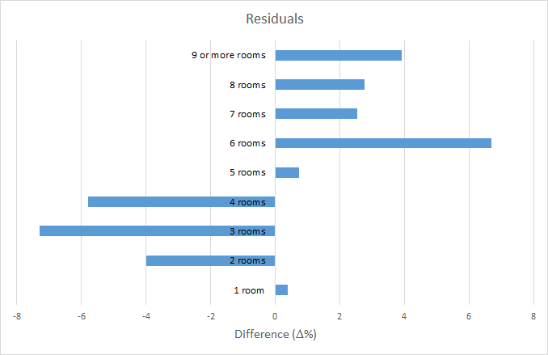
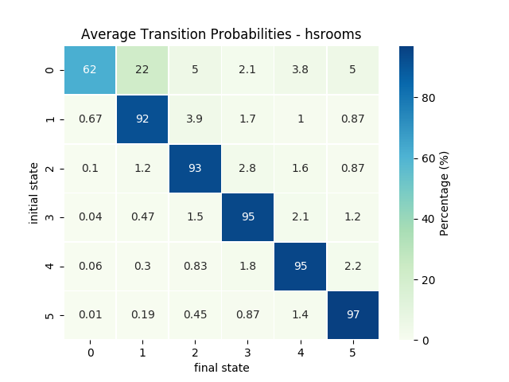

# UKsurvey

Things to do:
- add summary of how data is used in the wider project 

## Table of contents
- **1.** [Introduction](#introduction)    
   + **1.1.** [SPENSER](#spenser)      
   + **1.2.** [Use within SPENSER](#use-within-spenser) 
- **2.** [Data](#data)
   + **2.1.** [Understanding Society](#understanding-society)       
   + **2.2.** [Census](#census)       
   + **2.3.** [Comparing Survey and Census Data](#comparing-survey-and-census-data)     
- **3.** [Household Microsynthesis](#household-microsynthesis)
- **4.** [Method](#method)
   + **4.1.** [Population Seed](#population-seed)
   + **4.2.** [Tracking Transitions](#tracking-transitions)
   + **4.3.** [Mapping Survey to Census](#mapping-survey-to-census)   

## Introduction
The objective of this project is to visualise the transitions that occur during the microsynthesis of population, as well as the events that trigger these transitions. This work is part of a bigger project aiming to create a framework for customisable population estimates (see [SPENSER](#spenser)). Here, understanding Society data is used to complement ONS census data. In the future, other datasets will be added. (consumer data, information on migration etc.)

### SPENSER 
Synthetic Population Estimation and Scenario Projection Model (SPENSER) is a synthetic population estimation and projection model which uses dynamic microsimulation. It provides the framework for estimates of population which are dynamic and high resolution (at household level); and a comprehensive set of tools for user customisable scenario projections. This project is in development by the University of Leeds.

### Use within SPENSER
Several scripts are available in this project to manipulate the data in Understanding Society. These may be used to track individual events (through individuals or households) for behavioural investigation, for example whether ceratin events are linked. On top of this, scripts can be used to produce aggregated survey data for statistical studies or as input in population microsynthesis.    
UKsurvey produces aggregated survey data which serves as input to microsimulation in the SPENSER project. Outputs already in use:
  
+ [crosstab](scripts/crosstab.py) outputs a 5 dimensional matrix which acts as a population seed in household microsynthesis.    
+ [tpm](scripts/tpm.py) generates a transition probability matrix, i.e. a table with probabilities of transition from one state to another. This is used to determine whether a transition occurs during microsynthesis.    

In general, this project can feed inputs for neworder's dynamic microsimulation environment as well as the quasi dynamic household microsimulation in SPENSER's microsimulation.    

## Data
### Understanding Society

Understanding Society is a longitudinal study of the behaviour of ~40,000 households across the UK.

Data can be downloaded from [UK Data Service](https://beta.ukdataservice.ac.uk/datacatalogue/series/series?id=2000053). It is available in several formats (SPSS, STATA, TAB). Downloading the TAB survey yields two folders: mrdoc and tab, the former contains documentation (including data dictionaries) and the latter the survey response data.

Data is divided into years or waves, each saved in its own subfolder. The survey changes over time so each folder will contain a different amount of files. However, there is a set of common files:

- **_w_callrec.tab_**
- **_w_child.tab_**
- **_w_egoalt.tab_**
- **_w_hhresp.tab_**
- **_w_hhsamp.tab_**
- **_w_income.tab_**
- **_w_indall.tab_**
- **_w_indresp.tab_**
- **_w_youth.tab_**

Where **_w__** is a prefix denoting the wave. The first wave is denoted _a_, second wave is _b_ etc.    
Individuals have a unique ID (**_pidp_**), which is persistent throughout the study. Households also have their own ID (**_w_hidp_**), nonetheless this is wave specific, thus cannot be used to link information across waves. This means an individual's evolution can be tracked over time, but household transitions have an added layer of complexity. 

The largest files are the individual survey responses (**_w_indresp.tab_**). The other group of files of interest are the household response files (**_w_hhresp.tab_**).

|File name |Number of variables* |Description                                          |
|----------|---------------------|-----------------------------------------------------|
|w_hhresp  |200-550              | Substantive data from responding households          
|w_indresp |1300-2900            | Substantive data from responding adults (16+)        
|w_youth   |120-170              | Substantive data from youth questionnaire (10-15)    
|w_hhsamp  |50-200               | Data from Address Record File for issued households  
|w_indall  |100-200              | Household grid data for all persons in household, including children and non respondents
|w_child   |130-350              | Childcare, consents and school information of all children in the household 
|w_egoalt  |10-25                | Kin and other relationships between pairs of individuals in the household

<sub><nowiki>*<nowiki>Questions asked in the survey changed every year, so the number of variables is inconsistent.<sub>

There is another subfolder with cross wave data. It consists of three files:

|File name |Description                                           |
|----------|------------------------------------------------------|
|xwavedat  | Substantive data from responding households          |
|xivdata   | Substantive data from responding adults (16+)        |
|xwaveid   | Individual and household identifiers across all waves|

Cross wave files contain data from every wave, however, the files are small compared to __indresp__ and don't seem to have anything useful for microsynthesis - other than the identifiers in __xwaveid__.

There is considerable attrition in this survey, this is partially compensated by introducing new households in each wave, however, there is a net 23% decrease in housholds over the first 7 years. This decrease is shown in figure 1, as well as an example of data available in the survey, in this case whether a household is in an urban or rural area. 

    
**Figure 1.** Number of households in urban or rural areas. The number of houses decreases as the study goes on. The average split is 76% urban and 24% rural - standard deviation ~ 1.5%. 

More information on the survey can be found here: https://www.understandingsociety.ac.uk.

### Census

The UK Census is the most accurate representation of UK population data available, thus is often used for population microsynthesis. However, it only occurs once every 10 years and lacks behavioural and consumer data. This is why it is important to complement census with other datasets. The Office for National Statistics (ONS) produces a national population census every 10 years. ONS gives free access to the latest one - currently 2011.     

Data can be obtained directly from [Nomisweb](https://www.nomisweb.co.uk).    
See [UKCensusAPI](https://github.com/virgesmith/UKCensusAPI) for a `python` and `R` wrapper.

### Comparing Survey and Census Data

Overall, the distributions obtained by Understanding Society match census data. There are some differences, mainly because the survey is much smaller than the census, but also because both are just samples of the true population. In order to compare both datasets, normalisation is required. All the graphs shown below display data as a percentage of the total for that year. 

All tested variables (tenure, bedrooms, rooms, occupants and composition) were highly correlated. The weakest associacion was with total number of rooms. This is most likely due to the mismatch in definitions for this variable on each dataset. However, there was still significant correlation, r-squared=0.738.  

The following graphs compare the distribution of census (blue) and survey (orange) data for 2011. 

     
**Figure 2.** Percentage distribution of number of bedrooms in each household. r-squared = 0.971.
<br><br>
         
**Figure 3.** Percentage distribution of total number of rooms in each household. r-squared = 0.738. There seems to be a shift in survey data compared to census data. This apparent systematic error could be due to the difference in definitions on what counts as a room.

There is a clear systematic error when comparing the total number of rooms in census and survey. This can be seen in figure 4 - a plot of the difference between the values given in the census compared to the survey. First, data is changed into percentages of the dataset's total and then survey values are subtracted from census ones. 

    
**Figure 4.** Difference between the distribution of total number of rooms in each household shown in the census to that in the survey.
<br><br>
     
**Figure 5.** Percentage distribution of number of occupants in each household. r-squared = 0.978.         

Note that the number of categories has been expaned here compared to what is used in population microsynthesis. This is to give a better view of the distributions and because the data is available to this degree of accuracy. Comparing household composition and tenure is also possible but the limited amount of categories makes the correlations less reliable.

     
**Figure 6.** Percentage distribution of tenure type in each household. r-squared = 0.978.
<br><br>

**Figure 7.** Percentage distribution of household composition. r-squared = 0.931.

Although the number of households is large (order 10,000s for survey and 10,000,000s for census), the coefficients of determination shown are based on the number of categories, which is quite small, so the values might be inflated.

## Household Microsynthesis

A crucial step in microsynthesis is considering the possible changes that could occur. Some changes to a household could be:

- Ageing
- Marriage / civil partnership
- Birth of a child / adoption
- Divorce / separation
- Death of a member
- Child moving out due to higher education / employment
- Member returning from higher study
- Changes in employment / retirement status
- Household location movement (internal migration)
- Leaving system (external migration)
- Leaving study (attrition)
- New household (external migration)
- New household (study recruitment)

Another thing to consider is that population microsynthesis requires an initial [seed](#population-seed), i.e. the initial state to forecast from. The idea is to have a matrix of possible states a household (or person) could be in and to populate these with an initial seed. The seed can be generated by [crosstabulating](scripts/crosstabulation.py) census (or survey) data, depending on the variables being explored, such that the frequency of households (or people) at each state is obtained.

Once an initial state is set, there are several methods to move the population forward in time. A common technique is to have a [transition probability matrix](scripts/tpm.py) (tpm), in which each element, _bij_, is the probability of being in state _j_ given that state _i_ was occupied in the previous time period. Monte Carlo simulation can then be used - a random number is generated and compared to the corresponding value in the tpm to determine whether the event is triggered. This process is repeated for every individual in the population.

Combining survey and census data is challenging due to the many ways variables can be defined, especially those relating to behaviours or to household composition. Even the definition of what a room is differs. These differences shouldn't affect microsynthesis, however, it is important to keep in mind that the results displayed will have slightly different interpretations.

An example of [household microsynthesis software](https://github.com/nismod/household_microsynth).

## Method
The overall aim of this work is to gain insights on the Understanding Society data, it's strengths and limitations and how it could be incorporated to a microsimulation of people or households.

Most data processing and analysis was done using Python3. All output files are saved as either tab separated or as CSV. Excel was used for plotting and correlation, although this could also be done in Python (check [quick_stats](scripts/quick_stats.py) for an example).

To start, download [Understanding Society data](https://beta.ukdataservice.ac.uk/datacatalogue/series/series?id=2000053).
Although the data can be accessed by anyone, it is technically safeguarded - requires registering in ukdataservice website - so it can not be included in this report. See [Understanding Society](#understanding-society) section for details about the data.

I initially did an overview of files present in the survey. Data is available for the previous British Household Panel Survey (BHPS), however, I have focused on Understanding Society waves only.

As with any longitudinal study, members drop out every year. A list of individuals present throughout the entire study can be obtained with the 'longevity' function in [track_ind](scripts/track_ind_.py). The script selects an individual from the list of those present in all waves. It then prints the personal ID (pidp) and the status evolution for a given variable, such as employment.     
In general, we are interested in distributions but a consistent list of individuals is handy when tracking individual events. The idea would be to relate changes to a household with events on an individual level, and whether certain events trigger certain changes.

It is also possible to obtain a list of household IDs (hidp) corresponding to each individual using [household stability](scripts/household_stability.py), however, this is not essential as something similar already exists in cross wave data files (xwaveid). It might still be useful, if looking to improve computational speed, as the list produced is smaller - 2.4MB (for individuals only present in all waves) compared to 22.7MB from the xwaveid file. WARNING: the code is very slow, it needs rewriting, takes over a day to run. The code can be altered to obtain household IDs for a given list of individuals (takes approximately 4 seconds per individual). A better solution is to use the [hh_list](scripts/track_hh.py) function, which creates a CSV file (9MB for all individuals, 4.6MB for unique households) by reading pidp and w_hidp columns from xwaveid.  

There is quite an extensive documentation on the [Understanding Society](https://www.understandingsociety.ac.uk.) website, including data dictionaries.
It is important to note that there is no location variable like the local authorities in census data. The highest resolution available is the region. There is more information, such as [output area classification](https://beta.ukdataservice.ac.uk/datacatalogue/studies/study?id=6674), but this requires special licence access.     

Some key questions to ask are:
   - What are the triggers that cause a household to change?    
   - What is the stability of households over time? (how many remain the same)  
   - Can we track an individual or a household over time?

It is computationally intensive to check all individual transitions. This is more so for households as _hipd_ is wave independent. Therefore, I looked at the overall distributions. I used [household distributions](scripts/household_distributions.py) to obtain counts of the required variable - could be anything from household composition to whether the house is in an urban or rural area. I then save these counts on excel, normalise to account for decrease in total housholds, and plot the distributions. This process could be automised on python, e.g. [quick_stats.py](scripts/quick_stats.py) but I find it easier to track on Excel. Also added correlations between each variable. Household size and composition is the pair with the highest correlation, r=0.72, followed by number of bedrooms and rooms (that aren't bedrooms), r=0.55. In theory, having enough information about a household could lead to infering some other unknown characteristic about it. 

All [distributions](docs/household_distributions.xlsx) seem to remain constant over time within a small error (<1%).     
See [comparing](#comparing-survey-and-census-data) section to see the correlation between survey and census data.
Download census data from [Nomisweb](https://www.nomisweb.co.uk).     
Distributions are the same for survey and census, for the variables tested.
It is hard to compare certain variables because of the definitions - see [mapping](#mapping-survey-to-census).

### Population Seed

5 dimensions are required to create a population seed:

- tenure     
- number of rooms    
- number of occupants    
- number of bedrooms     
- household composition      

A table with the frequency of each possible 5-dimensional state can be obtained using [crosstabulation](scripts/crosstabulation.py). The program can take any number of waves as input and outputs one table per wave (in CSV format). The outputs of this script can be used as the seed in [household_microsynth](https://github.com/nismod/household_microsynth).

Output of crosstabulation.py (as well as csv files with the tables):
```bash
$ scripts/crosstabulation.py 1 2 3 4 5 6 7
Processed wave 1: 29915 households
Number of occupied states: 574

Processed wave 2: 30367 households
Number of occupied states: 550

Processed wave 3: 27631 households
Number of occupied states: 527

Processed wave 4: 25554 households
Number of occupied states: 514

Processed wave 5: 23999 households
Number of occupied states: 513

sys:1: DtypeWarning: Columns (395,396,399,400) have mixed types. Specify dtype option on import.
Processed wave 6: 24296 households
Number of occupied states: 515

Processed wave 7: 22854 households
Number of occupied states: 496
```

Note: reading in wave f produces a pandas warning due to mixed types in columns (395,396,399,400), these columns are dates and are not used in the crosstabulation so just ignore. Whenever you read in the file for wave f, this error will appear unless you specify the column types dtype={'column_name': dtype}. (Note: setting dtype=object will silence the warning, but will not make it more memory efficient.)

Example of first lines in a table generated by code:

| tenure | rooms | occupants | bedrooms | hhtype | frequency |
|--------|-------|-----------|----------|--------|-----------|
| 0      | 0     | 0         | 0        | 0      | 1         |
| 0      | 0     | 1         | 0        | 1      | 1         |
| 0      | 0     | 1         | 0        | 2      | 1         |
| 0      | 1     | 0         | 0        | 0      | 130       |
| 0      | 1     | 1         | 0        | 1      | 29        |
| 0      | 1     | 1         | 0        | 2      | 5         |
| 0      | 1     | 1         | 0        | 4      | 2         |
| 0      | 2     | 0         | 0        | 0      | 37        |
| 0      | 2     | 0         | 1        | 0      | 560       |
| 0      | 2     | 1         | 0        | 1      | 15        |

There is still a diference between rooms in survey and census even after mapping. Perhaps the remap is not possible as it requires information we do not have, however, the distributions are quite close. It is just important to keep the different definitions in mind when looking at any outputs produced by the data. 

Constraints: make it impossible to occupy non-sensical states such as 3 people living in a 1 person household.    
This is different from improbable states. There is a high number of unoccupied states in the seed. Need to give these states a small occupation to differentiate from impossible states. 

There is the option to add more variables to the seed or to have other input tables. Dwelling type would be interesting but variable is stored in a different file (hhsamp instead of hhresp) so will make code slower.

If using survey data with household_microsynth, make sure the column order is same as that in the code.     
Column names changed for hhsize and counts to avoid problems when calling due to pre existing functions 'size' and 'count'.    

Assigning couples in survey to either married or cohabiting in census randomly (50/50). In the England and Wales census, 77% of couples are married whilst only 23% are cohabiting. Using this doesn't make much difference compared to a 50/50 split - 1% loss of states. 
Additionally, changing the order of crosstabulation seems to make no change to the number of occupied states. The number of states will vary slightly on every run due to the random splitting of couples. I have set a seed for the sake of reproducibility.

### Tracking Transitions

Output of [track_ind.py](scripts/track_ind.py):
```bash
$ scripts/track_ind.py -p -
Loading wave 1 data...
Loading wave 2 data...
Loading wave 3 data...
Loading wave 4 data...
Loading wave 5 data...
Loading wave 6 data...
Loading wave 7 data...

Individual - started as 'in paid employment' and finished as 'retired'
[2, 2, 2, 2, 2, 4, 4]
```
The individual can be changed using the '_-p_' flag and the variable has to be changed manually in the code.

Can track households over time using [track_hh.py](scripts/track_hh.py). This is similar to track_ind.py but looks for household data rather than individual response data. The script tracks the evolution of any chosen variable:

```bash
$ scripts/track_hh.py
pidp: -
variable: _hhsize

Generating household list...
Extracting variable data...
sys:1: DtypeWarning: Columns (395,396,399,400) have mixed types. Specify dtype option on import.
     pidp  a_hhsize  b_hhsize  c_hhsize  d_hhsize  e_hhsize  f_hhsize  g_hhsize
0     -       -9         3         3         3         3         4         4
```
In the example above, the household was recruited in wave 2 and stayed for the rest of the study. The household size increased between wave 5 and wave 6. The same can be done for any household number and any variable in _hhsresp.tab_.

Updated tracking to display several households at the same time and option to filter through demographics, such as gender. Use track_hh.py if interested in a specific household and [track_households.py](scripts/track_households.py) for groups of individuals with similar characteristics. 

Changed track_hh so that -p is an optional argument to specify the pidp.
Track_households.py takes two optional arguments -s and -b to specify a given sex or year of birth. It also has a positional argument to chose a variable of interest (write without the wave prefix 'w').

Use [track_hrpid](scripts/track_hrpid.py) to track the reference person of each household. This is a more stable approach to tracking households as track_households.py might track a member that leaves the household. It has the same arguments except -ab instead of -b to denote an age band with two inputs (lower and upper margins).

```bash
$ scripts/track_hrpid.py -s 2 -ab 30 44 hhtype_dv

variable: _hhtype_dv

Generating household list...
sys:1: DtypeWarning: Columns (395,396,399,400) have mixed types. Specify dtype option on import.
sex: [2]

age band: 30-44
households inside age band: 3414

Extracting variable data...
          a_hhtype_dv  b_hhtype_dv  c_hhtype_dv  d_hhtype_dv  e_hhtype_dv  f_hhtype_dv  g_hhtype_dv
hrpid
  -           11            4           20           20           20           19           19
  -            5            5           -9           18            5            5            5
  -            4            4            4            4            4            4            4
  -           11           11           11           11           11           11           11
  -           10           10           10           10           10           10           10
  -           20           20           20           10           20           20           20
  -            5           12           -9           12           11           10           -9
  -            5            5            5            5            5           -9           -9
  -            6            6            6            6            6            6            6
  -           11           11           11           11           20           20           20
```

In this example, we can see a snippet of the household composition for women between 30 and 44 years old (at the start of the study). As expected, most households are stable and remain in the same state over time. However, some transitions are visible. For example, the first household started as a couple with 2 children, has several transitions and ends as 3 or more adults with no children.     
Note: house reference person id (hrpid) is omitted here but will be shown when runing the code. Values of '-9' symbolise missing data.   

[Probability](scripts/probabilites.py) of transitions given an initial state. This outputs a dataframe with the percentage of households in a final state at wave _w+1_ given an initial state in wave _w_. It also prints a table for transitions from wave _a_ to wave _w_.

```bash
$ scripts/probabilites.py

variable: _hhtype_dv
initial state: 3
Loading household data...

sys:1: DtypeWarning: Columns (395,396,399,400) have mixed types. Specify dtype option on import.

%hh transitions from intial state (3) in wave w to state in w+1:
             b_hhtype_dv  c_hhtype_dv  d_hhtype_dv  e_hhtype_dv  f_hhtype_dv  g_hhtype_dv  average
final state
1                   1.60         2.00         2.10         2.49         1.88         1.66     1.95
2                   2.29         2.66         2.53         2.26         2.09         2.32     2.36
3                  88.68        88.05        88.78        88.84        88.00        88.17    88.42
4                   0.59         0.77         0.62         0.46         0.30         0.54     0.55
5                   0.21         0.13         0.04         0.12         0.04         0.25     0.13
6                   3.30         3.13         3.00         3.22         3.84         3.45     3.32
8                   0.14         0.20         0.07         0.15         0.04         0.00     0.10
10                  0.63         0.63         0.54         0.23         0.30         0.29     0.44
11                  0.21         0.37         0.11         0.15         0.09         0.29     0.20
12                  0.14         0.07         0.04         0.00         0.04         0.04     0.05
16                  1.53         1.46         1.34         1.15         2.22         1.87     1.60
17                  0.10         0.07         0.14         0.08         0.17         0.12     0.11
18                  0.21         0.03         0.18         0.08         0.09         0.08     0.11
19                  0.17         0.17         0.14         0.27         0.47         0.29     0.25
20                  0.00         0.07         0.00         0.08         0.04         0.25     0.07
22                  0.21         0.20         0.36         0.35         0.34         0.29     0.29
23                  0.00         0.00         0.00         0.08         0.04         0.08     0.03

Percentage stable households (present in all waves): 54.53%
788/1445 households remained at value = 3

%hh transitions from intial state (3) in wave a to state in w:
                ab     ac     ad     ae     af     ag
final state
1             1.60   3.57   5.33   7.34   9.52  10.80
2             2.29   4.92   7.33   9.14  10.74  12.81
3            88.68  80.43  73.59  68.64  62.12  58.35
4             0.59   0.95   1.22   1.37   1.38   1.34
5             0.21   0.16   0.22   0.38   0.42   0.33
6             3.30   4.41   5.54   5.87   6.61   6.35
8             0.14   0.40   0.65   0.85   1.22   1.45
10            0.63   1.59   1.92   2.04   2.33   2.34
11            0.21   0.28   0.44   0.76   0.90   1.61
12            0.14   0.24   0.22   0.24   0.37   0.45
16            1.53   1.67   2.18   1.66   1.96   2.06
17            0.10   0.40   0.57   0.52   0.90   0.78
18            0.21   0.28   0.26   0.28   0.32   0.22
19            0.17   0.12   0.22   0.33   0.53   0.67
22            0.21   0.48   0.22   0.28   0.21   0.11
```
In this example, the initial state in wave a is 3 (_1 adult under pensionable age, no children_). The first table shows transitions from wave w to wave w+1, whilst the second table shows transitions from wave a to wave w. In this case, 88.7% of households remain at the same state in wave b, 80.4% in wave c and so on. 

A table with probabilities of transition from state _i_ in wave _w_ to state _j_ in wave _w+1_ can be obtained using [tpm.py](scripts/tpm.py). It only requires the variable of interest. For example, using household composition (_hhtype_dv_):

```bash
$ scripts/tpm.py

variable: _hhtype_dv
Loading household data...

sys:1: DtypeWarning: Columns (395,396,399,400) have mixed types. Specify dtype option on import or set low_memory=False.
Calculating average transition probabilities...
final state       1      2      3      4      5      6      8      10     11     12     16     17     18     19     20     21     22     23
initial state
1              98.78   0.09   0.02   0.00   0.00   0.00   0.48   0.00   0.00   0.00   0.00   0.39   0.04   0.08   0.04   0.00   0.08   0.00
2               0.05  98.65   0.00   0.02   0.00   0.00   0.23   0.00   0.00   0.00   0.00   0.85   0.06   0.06   0.02   0.00   0.05   0.02
3               1.95   2.36  88.42   0.55   0.13   3.32   0.10   0.44   0.20   0.05   1.60   0.11   0.11   0.25   0.07   0.00   0.29   0.03
4               0.00   0.12   1.94  80.59   3.21   0.19   0.00   3.01   0.89   0.07   7.63   0.29   1.34   0.31   0.15   0.00   0.25   0.02
5               0.02   0.00   0.40   1.42  80.66   0.02   0.00   0.07   2.84   2.01   0.14   0.02  10.99   0.00   0.44   0.00   0.52   0.45
6               0.00   0.03   1.81   0.02   0.00  83.30   6.05   5.77   0.23   0.08   0.34   0.01   0.01   2.10   0.21   0.00   0.02   0.01
8               0.64   0.51   0.06   0.00   0.00   0.01  97.52   0.03   0.00   0.00   0.01   0.13   0.00   1.04   0.05   0.00   0.00   0.00
10              0.00   0.00   0.60   1.07   0.09   1.02   0.08  77.30  11.75   0.22   0.12   0.00   0.20   6.02   1.48   0.00   0.00   0.05
11              0.00   0.00   0.44   0.04   1.02   0.02   0.01   0.87  86.80   3.66   0.01   0.00   0.08   0.53   6.50   0.00   0.00   0.03
12              0.02   0.00   0.32   0.07   1.11   0.02   0.00   0.10   1.04  87.05   0.02   0.00   0.25   0.00   6.01   0.02   0.00   3.98
16              0.16   0.37  13.69   1.00   0.03   3.11   0.10   0.24   0.03   0.00  71.66   3.60   0.90   2.03   0.44   0.00   2.51   0.13
17              1.69   6.54   0.98   0.00   0.00   0.00   0.96   0.00   0.00   0.00   0.00  87.43   0.17   0.81   0.16   0.00   1.08   0.18
18              0.05   0.49   1.83   6.62   6.08   0.06   0.04   0.76   0.55   0.21   2.33   0.42  61.02   0.49   2.27   0.00   9.09   7.69
19              0.02   0.08   0.49   0.02   0.00   7.63   4.19   0.78   0.07   0.03   0.57   0.37   0.02  82.89   2.30   0.00   0.47   0.07
20              0.00   0.05   0.27   0.26   0.19   1.14   0.38   5.12   3.57   0.65   0.26   0.07   0.66  14.91  70.73   0.05   0.21   1.49
21              0.00   0.00   0.00   0.00   0.00   0.00   0.00   0.00   0.00   9.03   0.00   0.00   1.28   0.00   5.19  57.12   0.00  27.38
22              0.06   0.30   4.71   0.11   0.00   0.64   0.00   0.11   0.06   0.00  12.67   3.03   0.78   3.92   0.23   0.06  71.74   1.60
23              0.00   0.00   0.53   0.73   0.67   0.13   0.06   0.53   0.94   3.60   0.67   0.41   5.84   0.27  12.57   1.01   5.06  66.97
```

This yields a table for _hhtype_dv_. Rows are the initial state at wave _w_ and columns the final state at wave _w+1_. The sum of each row such be the 100%.    

The script contains an optional flag '-r' to remap the chosen variable in order to match census definitions:  
```bash
$ scripts/tpm.py hsrooms -r

variable: _hsrooms
remap selected
Loading household data...

sys:1: DtypeWarning: Columns (395,396,399,400) have mixed types. Specify dtype option on import.
Calculating average transition probabilities...
final state        0      1      2      3      4      5
initial state
0              61.99  22.14   4.95   2.09   3.84   4.99
1               0.67  91.86   3.86   1.74   1.01   0.87
2               0.10   1.18  93.44   2.82   1.58   0.87
3               0.04   0.47   1.51  94.63   2.13   1.22
4               0.06   0.30   0.83   1.76  94.87   2.18
5               0.01   0.19   0.45   0.87   1.44  97.03
```

This matrix is also given in the form of a heatmap for easier visualisation.

    
**Figure 8.** Transition probability matrix for the total number of rooms. Each square displays the average percentage of households that started in the state shown in the y-axis and ended in the state shown in the x-axis. This example uses census definitions.

Note that results obtained with this method will approximate the true probability if an infinite number of households is used. This means that low density states are innacurate. For example, if there is only one household in a state, it will produce a 100% probability for that specific transition. This issue can be solved by capping states, such as considering a household size of 4 to mean 4 or more.   

Check docs [readme](docs/README.md) for information on distributions and graphs shown in this file.     
Check docs [metadata](docs/metadata) for information on variable values. Only a few listed, use [UK Data Service](https://beta.ukdataservice.ac.uk/datacatalogue/series/series?id=2000053) for the full list.

### Mapping Survey to Census

The categories and definitions used to describe households differ between survey and census data. This means a remapping of data is needed in order to compare between both sources, as well as to use programs, such as [household_microsynth](https://github.com/nismod/household_microsynth), initially made for census inputs.

The first step is to filter the negative values. These are codes for "missing" (-9), "inapplicable" (-8) etc. and need to be dropped before any further preprocessing. This is especially important when combining data because artificial values could be created. For example, to determine the total number of rooms in a house we could add the bedrooms (e.g. -9 bedrooms) and other rooms (e.g. 10 rooms) in a house, however, one of the two values could be missing thus the sum will be erroneous (-9 + 10 = 1 total rooms). 

The census gives the total number of rooms in a household, whilst the survey gives the number of rooms excluding bedrooms. Therefore,  a new column, _rooms_, must be generated by adding bedrooms, _hsbeds_, and other rooms, _hsrooms_.

Only four categories of tenure are used in household_microsynth from the seven available in survey data:

|Census              | Understanding Society                          |
|--------------------|------------------------------------------------|
|Owned outright      | Owned outright                                 |
|Owned with mortgage | Owned with mortgage                            |
|Rented social       | Local authority rent + Housing associated rent |
|Rented private      | Rented private Unfurnished + Furnished + Other |

A more complex mapping is needed for household composition as the categories don't exactly match:

|Census             | Understanding Society                                              |
|-------------------|--------------------------------------------------------------------|
|Single occupancy   | 1 male, aged 65+; 1 female, age 60+; 1 adult under pensionable age |
|Single parent      | 1 adult, 1 child; 1 adult, 2 or more children                      |
|Married or Cohabiting couple*    | Couple under pensionable age, no children; Couple 1 or more over pensionable age, no children; Couple with 1 child; Couple with 3 or more children; 3 or more adults, 1-2 children, incl. at least one couple; Couple with 2 children; 3 or more adults, no children, incl. at least one couple; 3 or more adults, >2 children, incl. at least one couple
|Mixed              | 2 adults, not a couple, one or more over pensionable age, no children; 2 adults, not a couple, 1 or more children; 2 adults, not a couple, 1 or more children; 3 or more adults, no children, excl. any couples; 3 or more adults, 1 or more children, excl any couples

<nowiki>*<nowiki> Understanding Society doesn't differentiate between married and cohabiting couples in the _hhtype_ variable, thus it is not possible to match accurately. A random 50-50 split yields a number of occupied states ~2% higher the assigning half the categories to married and half to cohabiting couples. The actual split in England and Wales is around 77% married or same sex civil partnership and 23% cohabiting couples, however, this will vary from one local authority to the next. Could also combine "Couples" into a single category.
    
The survey gives values for each individual but the census gives distributions. In the case of sizes, these are capped, thus the same needs to be done to survey data, with the final number, _n_, being interpreted as _n or more_:

- rooms cap at 6   
- bedrooms cap at 4   
- occupants cap at 4   

Room and bedroom sizes are also shifted by subtracting one from all sizes bigger than 1. This is because the census considers values of zero bedrooms to be equal to one bedrooms. So all _n_ > 1 are changed to _n-1_ whilst _n=0_ is unchanged, resulting in a final value of _n=0_ being a sum of intial zero bedroom and one bedroom households.
